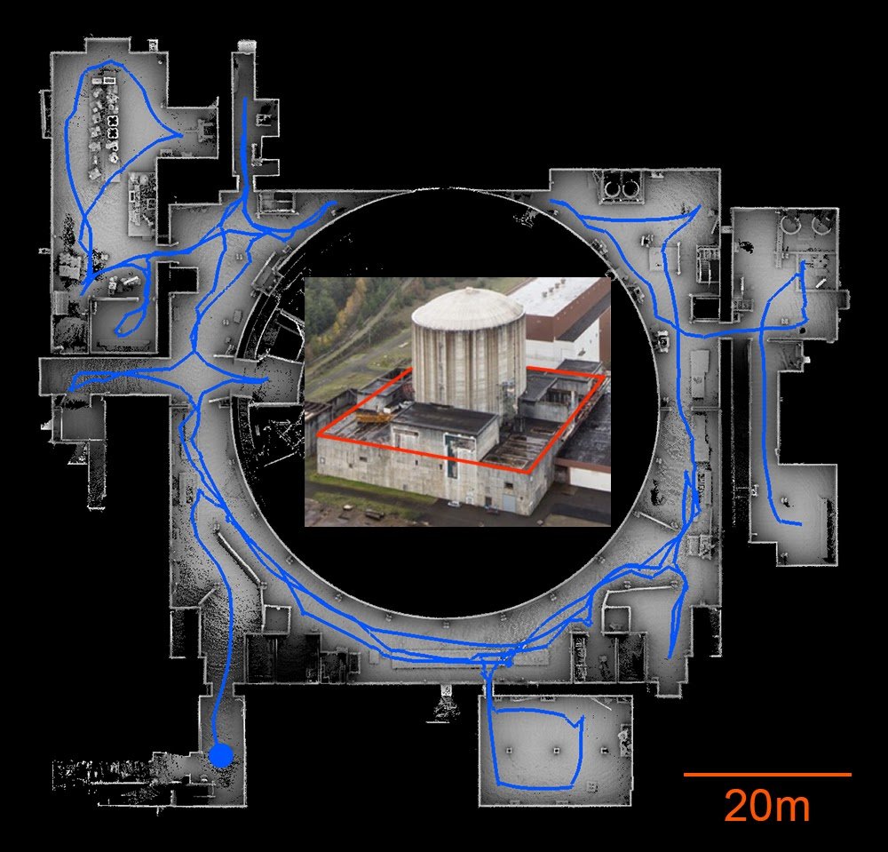

TARE planner involves a hierarchical framework for highly efficient exploration - one level in the framework maintains data densely and computes a detailed path within a local planning horizon, another level maintains data sparsely and computes a coarse path at the global scale. The paths at both levels are joined together to form the exploration path. The framework draws the insight that detailed processing is most effective close to the vehicle, while coarse processing provides sufficient utility far away from the vehicle. The framework trades-off details at the global scale for computational speed. In practice, the framework prioritizes the exploration in the surroundings of the vehicle while keeping the global picture in mind.
<p align="center">
  
</p>

Please use instructions on our [project page](https://www.cmu-exploration.com/tare-planner).

## Usage
The repository has been tested in Ubuntu 18.04 with ROS Melodic and Ubuntu 20.04 with ROS Noetic. Due to usage of [OR-Tools](https://developers.google.com/optimization) library, the code only supports AMD64 architecture and currently does not compile on ARM computers. To setup TARE Planner, clone the repository.
```
git clone https://github.com/caochao39/tare_planner.git
```
In a terminal, go to the folder and compile.

```
cd tare_planner
catkin_make
```
To run the code, setup [Autonomous Exploration Development Environment](http://cmu-exploration.com) (checkout the correct branch, compile, and download the simulation environments). Then, go to the folder in a terminal, source the ROS workspace, and launch.
```
source devel/setup.sh
roslaunch vehicle_simulator system_garage.launch
```
In another terminal, go to the TARE Planner folder, source the ROS workspace, and launch.
```
source devel/setup.sh
roslaunch tare_planner explore_garage.launch
```
Now, users should see autonomous exploration in action. To launch with a different environment, use the command lines below instead and replace '\<environment\>' with one of the environment names in the development environment, i.e. 'campus', 'indoor', 'garage', 'tunnel', and 'forest'.
```
roslaunch vehicle_simulator system_<environment>.launch
roslaunch tare_planner explore_<environment>.launch
```

#### Launch with arguments
* rosbag_record: record a rosbag or not. If ```=true```, rosbags will be recorded to ```[home]/<bag_path>/<bag_name_prefix>_<timestamp>.bag``` with both the input and output topics from the planner. Note that '\<bag_path\>' and '\<bag_name_prefix\>' are both launch arguments that can be specified by the user.

* rviz: launch Rviz for visualization or not. If ```=true```, Rviz will be launched.

## Publications
- C. Cao, H. Zhu, H. Choset, and J. Zhang. TARE: A Hierarchical Framework for Efficiently Exploring Complex 3D Environments. Robotics: Science and Systems Conference (RSS). Virtual, July 2021. **Best Paper Award and Best System Paper Award**.
- C. Cao, H. Zhu, H. Choset, and J. Zhang: Exploring Large and Complex Environments
Fast and Efficiently. International Conference on Robotics and Automation (ICRA), Xi'an, China, June 2021.
```
@inproceedings{cao2021tare,
  title={TARE: A Hierarchical Framework for Efficiently Exploring Complex 3D Environments},
  author={Chao, Cao and Hongbiao, Zhu and Howie, Choset and Ji, Zhang},
  booktitle={Robotics: Science and Systems Conference (RSS)},
  year={2021},
  month={July},
  address={Virtual}
}

@inproceedings{cao2021exploring,
  title={Exploring Large and Complex Environments
Fast and Efficiently},
  author={Chao, Cao and Hongbiao, Zhu and Howie, Choset and Ji, Zhang},
  booktitle={IEEE International Conference on Robotics and Automation (ICRA)},
  year={2021},
  month={June},
  address={Xi'an, China}
}
```

## Applications
TARE Planner has been used by the [CMU-OSU Team](https://www.subt-explorer.com) in attending the [DARPA Subterranean Challenge](https://www.subtchallenge.com). The team has won the 1st place in Tunnel Circuit Competition and 2nd place in Urban Circuit Competition. Below is our result from Urban Circuit Competition which took place in Satsop Nuclear Plant, WA. Our vehicle traveled over 886m in 1458s to explore the site, fully autonomously. The final event will be held in September 2021.
<p align="center">
  
</p>

### Author
Chao Cao (ccao1@andrew.cmu.edu)

### Credit
[OR-Tools](https://developers.google.com/optimization) is from Google
